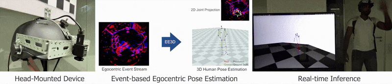

# EventEgo3D++: 3D Human Motion Capture from a Head-Mounted Event Camera 
<center>

Christen Millerdurai<sup>1,2</sup>, Hiroyasu Akada<sup>1</sup>, Jian Wang<sup>1</sup>, Diogo Luvizon<sup>1</sup>, 
Alain Pagani<sup>2</sup>, Didier Stricker<sup>2</sup>, Christian Theobalt<sup>1</sup>, Vladislav Golyanik<sup>1</sup>


<sup>1</sup> Max Planck Institute for Informatics, SIC  &nbsp; &nbsp; &nbsp; &nbsp; <sup>2</sup> DFKI Augmented Vision    

</center>

## Official PyTorch implementation

[Project page](https://eventego3d.mpi-inf.mpg.de/) | [arXiv](https://arxiv.org/abs/2502.07869v1) | [IJCV](https://link.springer.com/article/10.1007/s11263-025-02489-1)

<p align="center">
</br>
</p>

### Abstract

Monocular egocentric 3D human motion capture remains a significant challenge, particularly under conditions of low lighting and fast movements, which are common in head-mounted device applications. Existing methods that rely on RGB cameras often fail under these conditions. To address these limitations, we introduce EventEgo3D++, the first approach that leverages a monocular event camera with a fisheye lens for 3D human motion capture. Event cameras excel in high-speed scenarios and varying illumination due to their high temporal resolution, providing reliable cues for accurate 3D human motion capture. EventEgo3D++ leverages the LNES representation of event streams to enable precise 3D reconstructions. We have also developed a mobile head-mounted device (HMD) prototype equipped with an event camera, capturing a comprehensive dataset that includes real event observations from both controlled studio environments and in-the-wild settings, in addition to a synthetic dataset. Additionally, to provide a more holistic dataset, we include allocentric RGB streams that offer different perspectives of the HMD wearer, along with their corresponding SMPL body model. Our experiments demonstrate that EventEgo3D++ achieves superior 3D accuracy and robustness compared to existing solutions, even in challenging conditions. Moreover, our method supports real-time 3D pose updates at a rate of 140Hz. This work is an extension of the EventEgo3D approach (CVPR 2024) and further advances the state of the art in egocentric 3D human motion capture


### Advantages of Event Based Vision
High Speed Motion                      |  Low Light Performance          
:-------------------------:|:-------------------------:|
|  |  |

### Method

<p align="center">
</br>
</p>

## Usage
-----
- [EventEgo3D++: 3D Human Motion Capture from a Head-Mounted Event Camera](#eventego3d-3d-human-motion-capture-from-a-head-mounted-event-camera)
  - [Official PyTorch implementation](#official-pytorch-implementation)
    - [Abstract](#abstract)
    - [Advantages of Event Based Vision](#advantages-of-event-based-vision)
    - [Method](#method)
  - [Usage](#usage)
    - [Installation](#installation)
      - [Dependencies](#dependencies)
      - [Pretrained Models](#pretrained-models)
    - [Datasets](#datasets)
    - [Training](#training)
    - [Evaluation](#evaluation)
      - [EE3D-S](#ee3d-s)
      - [EE3D-R](#ee3d-r)
      - [EE3D-W](#ee3d-w)
  - [Citation](#citation)
  - [License](#license)
  - [Acknowledgements](#acknowledgements)
------

### Installation

Clone the repository
```bash
git clone https://github.com/Chris10M/EventEgo3D_plus_plus.git
cd EventEgo3D_plus_plus
```

#### Dependencies
Create a conda enviroment from the file 
```bash
conda env create -f EventEgo3D.yml
```
Next, install  **[ocam_python](https://github.com/Chris10M/ocam_python.git)** using pip
```bash
pip3 install git+https://github.com/Chris10M/ocam_python.git
```


#### Pretrained Models 

The pretrained models for [EE3D-S](#ee3d-s), [EE3D-R](#ee3d-r) and [EE3D-W](#ee3d-w) can be downloaded from  

- [EE3D-S](https://eventego3d.mpi-inf.mpg.de/eventego3dplusplus/savedmodels/EE3D-S_pretrained_weights.pth) 
- [EE3D-R](https://eventego3d.mpi-inf.mpg.de/eventego3dplusplus/savedmodels/EE3D_R_finetuned_weights.pth)
- [EE3D-W](https://eventego3d.mpi-inf.mpg.de/eventego3dplusplus/savedmodels/EE3D_W_finetuned_weights.pth)

Please place the models in the following folder structure.

```bash
EventEgo3D_plus_plus
|
└── saved_models
         |
         └── EE3D-S_pretrained_weights.pth
         └── EE3D_R_finetuned_weights.pth
         └── EE3D_W_finetuned_weights.pth

```


### Datasets

The datasets can obtained by executing the files in [`dataset_scripts`](./dataset_scripts/). For detailed information, refer [here](./dataset_scripts/). 


### Training

For training, ensure [EE3D-S](./dataset_scripts#ee3d-s), [EE3D-R](./dataset_scripts#ee3d-r), [EE3D-W](./dataset_scripts#ee3d-w) and [EE3D[BG-AUG]](./dataset_scripts#ee3d-bg-aug) are present. 
The batch size and checkpoint path can be specified with the following environment variables, ```BATCH_SIZE``` and ```CHECKPOINT_PATH```.

```bash
python train.py 
```

### Evaluation

#### EE3D-S 
For evaluation, ensure [EE3D-S Test](./dataset_scripts#ee3d-s-test) is present. Please run, 

```bash
python evaluate_ee3d_s.py 
```

The provided [pretrained](#pretrained-models) checkpoint gives us an accuracy of,

| Arch | Head_MPJPE | Neck_MPJPE | Right_shoulder_MPJPE | Right_elbow_MPJPE | Right_wrist_MPJPE | Left_shoulder_MPJPE | Left_elbow_MPJPE | Left_wrist_MPJPE | Right_hip_MPJPE | Right_knee_MPJPE | Right_ankle_MPJPE | Right_foot_MPJPE | Left_hip_MPJPE | Left_knee_MPJPE | Left_ankle_MPJPE | Left_foot_MPJPE | MPJPE | Head_PAMPJPE | Neck_PAMPJPE | Right_shoulder_PAMPJPE | Right_elbow_PAMPJPE | Right_wrist_PAMPJPE | Left_shoulder_PAMPJPE | Left_elbow_PAMPJPE | Left_wrist_PAMPJPE | Right_hip_PAMPJPE | Right_knee_PAMPJPE | Right_ankle_PAMPJPE | Right_foot_PAMPJPE | Left_hip_PAMPJPE | Left_knee_PAMPJPE | Left_ankle_PAMPJPE | Left_foot_PAMPJPE | PAMPJPE |
|---|---|---|---|---|---|---|---|---|---|---|---|---|---|---|---|---|---|---|---|---|---|---|---|---|---|---|---|---|---|---|---|---|---|---|
| EgoHPE | 18.794 | 20.629 | 34.370 | 62.688 | 87.136 | 36.535 | 73.797 | 107.610 | 73.904 | 116.881 | 176.932 | 191.418 | 73.927 | 120.475 | 186.601 | 197.100 | 98.675 | 35.090 | 32.134 | 35.672 | 61.661 | 84.088 | 36.707 | 59.447 | 90.251 | 52.273 | 75.313 | 97.924 | 109.323 | 51.162 | 77.778 | 98.785 | 104.684 | 68.893 |


#### EE3D-R
For evaluation, ensure [EE3D-R](./dataset_scripts#ee3d-r) is present. Please run, 

```bash
python evaluate_ee3d_r.py 
```

The provided [pretrained](#pretrained-models) checkpoint gives us an accuracy of,

| Arch | walk_MPJPE | crouch_MPJPE | pushup_MPJPE | boxing_MPJPE | kick_MPJPE | dance_MPJPE | inter. with env_MPJPE | crawl_MPJPE | sports_MPJPE | jump_MPJPE | MPJPE | walk_PAMPJPE | crouch_PAMPJPE | pushup_PAMPJPE | boxing_PAMPJPE | kick_PAMPJPE | dance_PAMPJPE | inter. with env_PAMPJPE | crawl_PAMPJPE | sports_PAMPJPE | jump_PAMPJPE | PAMPJPE |
|---|---|---|---|---|---|---|---|---|---|---|---|---|---|---|---|---|---|---|---|---|---|---|
| EgoHPE | 68.673 | 157.415 | 88.633 | 123.567 | 102.313 | 84.955 | 95.733 | 109.378 | 94.898 | 95.935 | 102.150 | 50.060 | 100.759 | 66.288 | 94.516 | 84.264 | 66.906 | 68.201 | 75.726 | 72.233 | 75.831 | 75.479 |

#### EE3D-W
For evaluation, ensure [EE3D-W](./dataset_scripts#ee3d-w) is present. Please run, 

```bash
python evaluate_ee3d_w.py 
```

The provided [pretrained](#pretrained-models) checkpoint gives us an accuracy of,

| Arch | walk_MPJPE | crouch_MPJPE | pushup_MPJPE | boxing_MPJPE | kick_MPJPE | dance_MPJPE | inter. with env_MPJPE | crawl_MPJPE | sports_MPJPE | jump_MPJPE | MPJPE | walk_PAMPJPE | crouch_PAMPJPE | pushup_PAMPJPE | boxing_PAMPJPE | kick_PAMPJPE | dance_PAMPJPE | inter. with env_PAMPJPE | crawl_PAMPJPE | sports_PAMPJPE | jump_PAMPJPE | PAMPJPE |
|---|---|---|---|---|---|---|---|---|---|---|---|---|---|---|---|---|---|---|---|---|---|---|
| EgoHPE | 164.634 | 160.878 | 171.486 | 145.806 | 172.317 | 163.608 | 164.298 | 151.324 | 193.632 | 173.872 | 166.185 | 93.441 | 96.686 | 105.231 | 69.619 | 89.755 | 97.718 | 90.325 | 85.122 | 104.570 | 98.185 | 93.065 |


## Citation

If you find this code useful for your research, please cite our paper:
```
@article{eventegoplusplus,
author={Millerdurai, Christen
and Akada, Hiroyasu
and Wang, Jian
and Luvizon, Diogo
and Pagani, Alain
and Stricker, Didier
and Theobalt, Christian
and Golyanik, Vladislav},
title={EventEgo3D++: 3D Human Motion Capture from A Head-Mounted Event Camera},
journal={International Journal of Computer Vision (IJCV)},
year={2025},
month={Jun},
day={11},
issn={1573-1405},
doi={10.1007/s11263-025-02489-1},
}
```
## License

EventEgo3D++ is under [CC-BY-NC 4.0](https://creativecommons.org/licenses/by-nc/4.0/) license. The license also applies to the pre-trained models.

## Acknowledgements

The code is partially adapted from [here](https://github.com/microsoft/human-pose-estimation.pytorch). 

